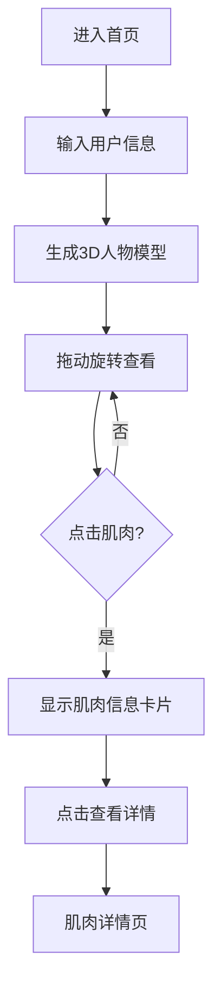

## 1. Product Overview
一款面向健身人群的微信小程序，根据用户输入的身高、体重、年龄等信息生成3D人物模型，展示肌肉轮廓，支持拖动旋转交互，点击肌肉可查看详细介绍和训练动作。

## 2. Core Features

### 2.1 User Roles
| Role | Registration Method | Core Permissions |
|------|---------------------|------------------|
| Normal User | WeChat login | Use all features |

### 2.2 Feature Module
1. **首页**: 用户信息输入、3D人物模型展示、肌肉交互
2. **肌肉详情页**: 肌肉介绍、训练动作列表
3. **个人中心**: 用户信息管理、历史记录

### 2.3 Page Details
| Page Name | Module Name | Feature description |
|-----------|-------------|---------------------|
| 首页 | 用户信息表单 | 输入身高、体重、年龄、性别 |
| 首页 | 3D人物模型 | 渲染肌肉轮廓，支持拖动旋转 |
| 首页 | 肌肉点击交互 | 点击肌肉区域显示信息卡片 |
| 肌肉详情页 | 肌肉介绍 | 展示肌肉名称、位置、功能 |
| 肌肉详情页 | 训练动作 | 展示相关训练动作列表 |
| 个人中心 | 用户信息 | 查看和编辑个人资料 |

## 3. Core Process

## 4. User Interface Design
### 4.1 Design Style
- **Primary Color**: #FF6B35 (活力橙色，代表运动与能量)
- **Secondary Color**: #1A1A2E (深色背景，突出肌肉轮廓)
- **Button Style**: 圆角矩形，渐变色填充
- **Font**: 思源黑体，清晰易读
- **Layout**: 现代卡片式布局
- **Icon Style**: 简约线条图标

### 4.2 Page Design Overview
| Page Name | Module Name | UI Elements |
|-----------|-------------|-------------|
| 首页 | 用户信息表单 | 输入框、滑块、提交按钮 |
| 首页 | 3D人物模型 | Canvas画布、控制按钮 |
| 首页 | 肌肉信息卡片 | 悬浮卡片、肌肉名称、简短描述 |
| 肌肉详情页 | 肌肉介绍 | 标题、图文描述 |
| 肌肉详情页 | 训练动作 | 动作卡片列表、动图展示 |

### 4.3 Responsiveness
- 移动端优先设计
- 触摸手势优化（滑动旋转、双指缩放）
- 响应式布局适配不同屏幕尺寸

### 4.4 3D Scene Guidance
- **Environment**: 深色渐变背景，突出人物模型
- **Lighting**: 多光源照明，展示肌肉立体感
- **Camera**: 轨道控制，支持360度旋转
- **Composition**: 人物居中，适当留白
- **Interactions**: 拖动旋转、点击高亮、悬停效果
- **Performance**: 优化移动端渲染性能

## 5. 微信小程序特性
### 5.1 小程序能力集成
| 能力 | 用途 | 说明 |
|------|------|------|
| 微信登录 | 用户身份认证 | 使用wx.login获取用户凭证 |
| 本地存储 | 用户数据持久化 | 使用wx.setStorageSync存储信息 |
| Canvas组件 | 3D渲染载体 | Three.js绑定Canvas进行WebGL渲染 |
| 页面路由 | 页面跳转 | 使用uni.navigateTo等API |

### 5.2 用户体验优化
- 首次进入引导流程
- 触摸手势优化
- 加载状态提示
- 错误处理和重试机制