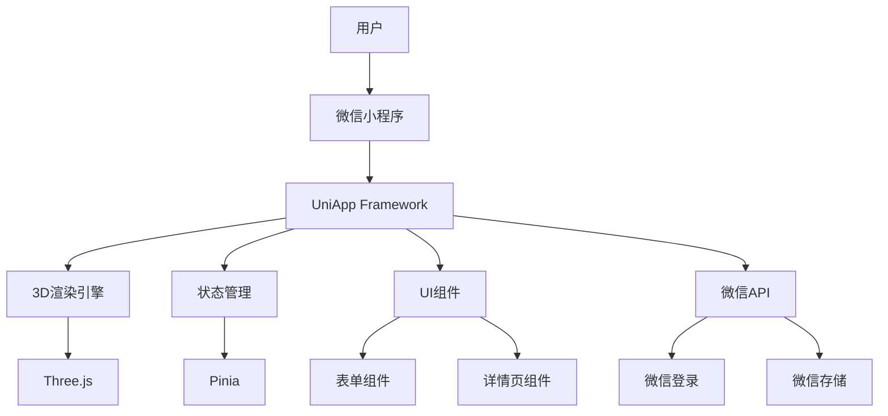
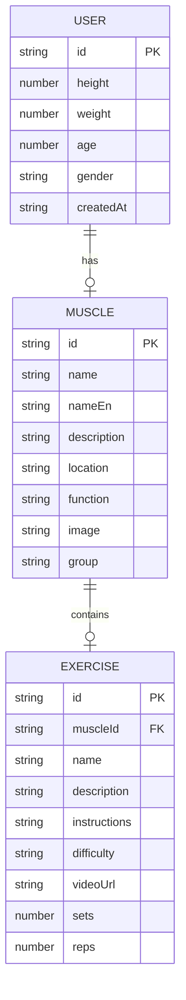
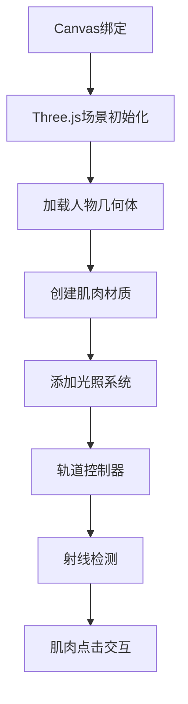

## 1. Architecture Design


## 2. Technology Description

### 2.1 技术选型总览

| 分类 | 技术 | 版本 | 选型理由 |
|------|------|------|----------|
| 框架 | UniApp | 3.0+ | 跨平台框架，支持微信小程序原生能力，开发效率高，生态成熟 |
| 语言 | TypeScript | 5.0+ | 类型安全，代码可维护性强，适合大型项目 |
| 3D渲染 | Three.js | 0.160+ | WebGL标准库，功能强大，社区活跃，支持骨骼动画和交互 |
| 状态管理 | Pinia | 2.0+ | Vue官方推荐，轻量级，类型支持好 |
| 样式 | SCSS + WXSS | - | 支持CSS预处理器，兼容小程序样式特性 |
| 图标 | UniIcons | - | UniApp官方图标库，适配多端 |
| 数据存储 | 微信小程序本地存储 | - | 小程序原生API，简单高效 |

### 2.2 核心技术栈

- **前端框架**: UniApp@3.0 + TypeScript
- **3D渲染引擎**: Three.js@0.160
- **状态管理**: Pinia@2.0
- **样式预处理**: SCSS
- **图标库**: UniIcons
- **构建工具**: Webpack/Vite

### 2.3 小程序原生能力

| 能力 | API | 用途 |
|------|-----|------|
| 用户登录 | `wx.login()` | 获取用户登录凭证 |
| 用户信息 | `wx.getUserProfile()` | 获取用户基本信息 |
| 本地存储 | `wx.setStorageSync()` | 持久化用户数据 |
| 网络请求 | `wx.request()` | 后端API调用 |
| 画布绑定 | `Canvas` | Three.js渲染载体 |

## 3. Route Definitions

| 页面路径 | 页面名称 | 功能说明 |
|----------|----------|----------|
| `/pages/home/index` | 首页 | 用户信息输入、3D人物模型展示、肌肉交互 |
| `/pages/muscle/index` | 肌肉详情页 | 肌肉介绍、训练动作列表 |
| `/pages/profile/index` | 个人中心 | 用户信息管理、历史记录 |

## 4. Data Model

### 4.1 Data Model Definition


### 4.2 数据存储方案

**本地存储结构**
```typescript
// 用户信息
interface UserInfo {
    id: string;
    height: number;      // 身高(cm)
    weight: number;      // 体重(kg)
    age: number;         // 年龄
    gender: 'male' | 'female';
    createdAt: string;
}

// 肌肉数据（预置数据）
interface Muscle {
    id: string;
    name: string;           // 中文名称
    nameEn: string;         // 英文名称
    description: string;    // 详细描述
    location: string;       // 位置描述
    function: string;       // 功能说明
    image: string;          // 图片路径
    group: string;          // 肌肉分组
}

// 训练动作数据（预置数据）
interface Exercise {
    id: string;
    muscleId: string;       // 关联肌肉ID
    name: string;           // 动作名称
    description: string;    // 动作描述
    instructions: string;   // 动作说明
    difficulty: string;     // 难度等级
    videoUrl: string;       // 视频链接
    sets: number;           // 建议组数
    reps: number;           // 建议次数
}
```

## 5. Project Structure
```
├── src/
│   ├── components/                 # 公共组件
│   │   ├── UserForm.vue           # 用户信息输入表单
│   │   ├── CharacterModel.vue     # 3D人物模型组件
│   │   ├── MuscleInfoCard.vue     # 肌肉信息悬浮卡片
│   │   ├── MuscleList.vue         # 肌肉列表
│   │   ├── ExerciseCard.vue       # 训练动作卡片
│   │   └── NavBar.vue             # 导航栏组件
│   ├── pages/                     # 页面目录
│   │   ├── home/                  # 首页
│   │   │   └── index.vue
│   │   ├── muscle/                # 肌肉详情页
│   │   │   └── index.vue
│   │   └── profile/               # 个人中心
│   │       └── index.vue
│   ├── stores/                    # 状态管理
│   │   └── userStore.ts           # 用户状态管理
│   ├── data/                      # 预置数据
│   │   └── muscles.ts             # 肌肉和训练动作数据
│   ├── utils/                     # 工具函数
│   │   └── index.ts               # 通用工具
│   ├── hooks/                     # 自定义钩子
│   │   └── use3DCharacter.ts      # 3D人物模型Hook
│   ├── types/                     # 类型定义
│   │   └── index.ts               # TypeScript类型定义
│   └── App.vue                    # 应用入口
├── static/                        # 静态资源
│   └── images/                    # 图片资源
├── pages.json                     # 页面配置
├── manifest.json                  # 应用配置
└── package.json                   # 项目依赖
```

## 6. API Definitions

### 6.1 数据说明
本项目使用Mock数据，不接入后端服务。所有肌肉数据和训练动作数据都预置在前端代码中。

### 6.2 本地数据接口

**获取所有肌肉数据**
```typescript
function getMuscles(): Muscle[]
```

**获取单个肌肉详情**
```typescript
function getMuscleById(id: string): Muscle | undefined
```

**获取指定肌肉的训练动作**
```typescript
function getExercisesByMuscleId(muscleId: string): Exercise[]
```

### 6.2 小程序API封装

**保存用户信息到本地存储**
```typescript
function saveUserInfo(user: UserInfo): void
```

**从本地存储获取用户信息**
```typescript
function getUserInfo(): UserInfo | null
```

## 7. 3D模型设计

### 7.1 人物模型结构
- 基于人体比例生成简化模型
- 根据身高体重调整体型比例
- 展示主要肌肉群轮廓

### 7.2 肌肉分组
| 分组 | 包含肌肉 |
|------|----------|
| 胸肌 | 胸大肌、胸小肌、前锯肌、肋间肌 |
| 背部肌群 | 背阔肌、斜方肌、竖脊肌、菱形肌、大圆肌、小圆肌 |
| 肩部肌群 | 三角肌前束、三角肌中束、三角肌后束、冈上肌、冈下肌 |
| 手臂肌群 | 肱二头肌、肱三头肌、肱肌、前臂屈肌、前臂伸肌 |
| 腹部肌群 | 腹直肌、腹外斜肌、腹内斜肌、腹横肌、髂腰肌 |
| 臀部肌群 | 臀大肌、臀中肌、臀小肌 |
| 腿部肌群 | 股四头肌、腘绳肌、缝匠肌、小腿三头肌、胫前肌 |

### 7.3 交互设计
- 触摸拖动旋转模型
- 点击肌肉高亮显示
- 显示肌肉信息卡片
- 支持双指缩放

### 7.4 渲染方案


## 8. 性能优化

### 8.1 渲染优化
- 使用简化几何体减少面数
- 启用WebGL2优化渲染性能
- 合理设置材质属性

### 8.2 内存优化
- 及时清理无用资源
- 使用对象池复用
- 图片资源懒加载

### 8.3 交互优化
- 触摸事件节流处理
- 合理设置射线检测频率
- 动画帧率自适应

## 9. 微信小程序特有配置

### 9.1 pages.json 关键配置
```json
{
    "pages": [
        {
            "path": "pages/home/index",
            "style": {
                "navigationBarTitleText": "健身助手",
                "navigationStyle": "custom"
            }
        },
        {
            "path": "pages/muscle/index",
            "style": {
                "navigationBarTitleText": "肌肉详情"
            }
        },
        {
            "path": "pages/profile/index",
            "style": {
                "navigationBarTitleText": "个人中心"
            }
        }
    ],
    "globalStyle": {
        "navigationBarTextStyle": "white",
        "navigationBarBackgroundColor": "#1A1A2E",
        "backgroundColor": "#1A1A2E"
    }
}
```

### 9.2 权限配置
```json
{
    "permission": {
        "scope.userInfo": {
            "desc": "用于获取用户信息"
        }
    }
}
```